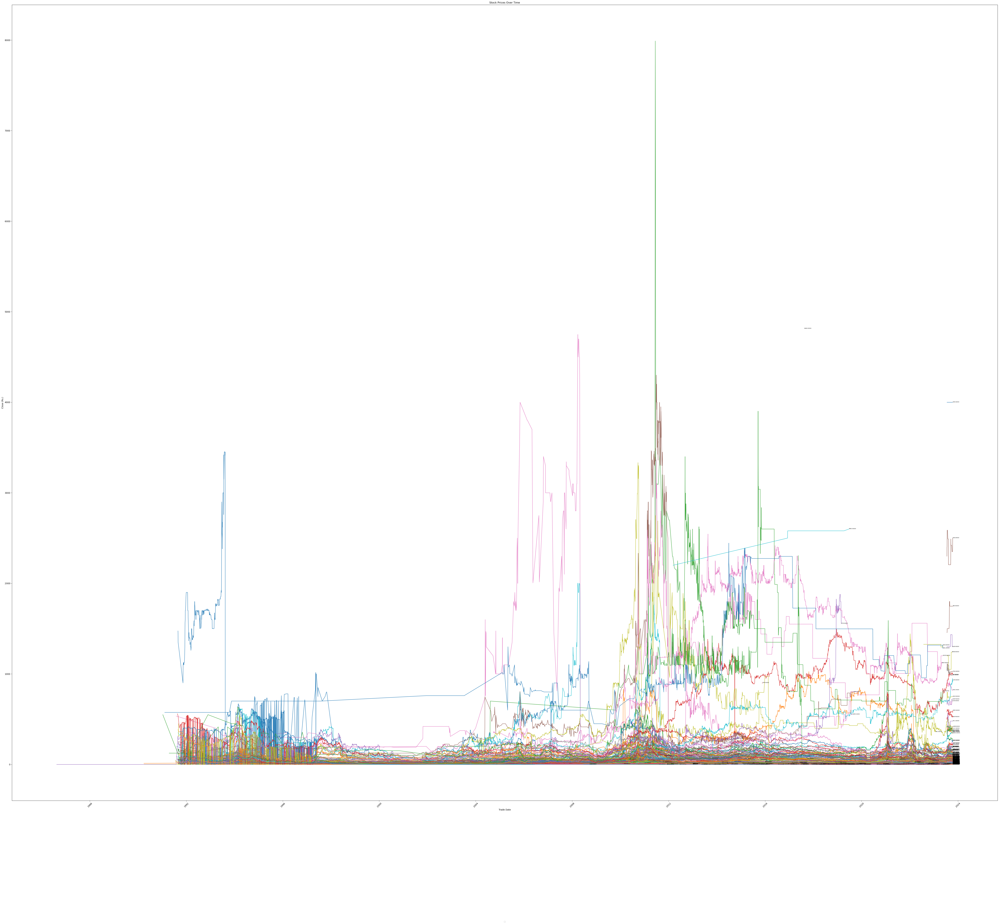
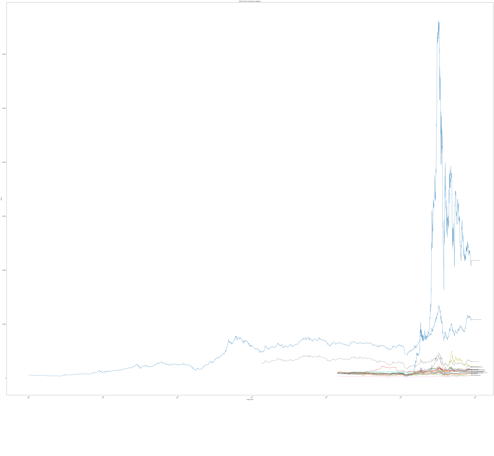

# CIS7017
This is my Data Science Degree Final Year Project. Technology Dissertation (CIS 7017) 

Final Research Topic

## Predictive Modeling and Analysis of Stock Market Trends using Large-Scale Data from the Colombo Stock Exchange 

Research Question 

## Do Inflation, Banking Loan Rates, Pandemics, Elections, Exchange Rates, and Natural Disasters impact the Colombo Stock Exchange stock prices?

Research Topics

1. Predictive Modeling and Analysis of Stock Market Trends using Large-Scale Data from the Colombo Stock Exchange - The primary objective of this dissertation is to develop predictive models that can forecast stock prices and market trends based on historical and real-time data from the Colombo Stock Exchange.

2. Analyzing medical images using deep learning - This project would use publicly available medical images to train a deep-learning model to diagnose diseases. The model could then be used to provide accurate diagnoses to patients, even in remote areas where there is limited access to healthcare professionals.

16th August 2023

While I looking for the ideal data set from Colombo stock exchange, I just found the following dataset from the following global entities  

1. Stock price data of the fifty stocks from NSE India  (2000 - 2021) - https://www.kaggle.com/datasets/rohanrao/nifty50-stock-market-data
2. Trading Imbalance in Chinese Stock Market - A High-Frequency View - https://figshare.com/articles/dataset/Trading_polarity_the_imbalance_of_buying_and_selling_in_stock_market/5835936
3. financialdatapy is a package for getting fundamental financial data of a company. Currently, it supports financial data of companies listed in United States (NASDAQ, NYSE) and South Korea (KOSPI, KOSDAQ). - https://pypi.org/project/financialdatapy/

My Research Question is "Do Inflation, Banking Loan Rates, Pandemics, Elections, Exchange Rates, and Natural Disasters impact the Colombo Stock Exchange stock prices?"

To turn this into a more comprehensive research study, I would typically need to:

Define the variables: Clearly specify how I will measure and define inflation, banking loan rates, stock market prices, and the occurrence of pandemics. This is essential for conducting empirical research.

Formulate hypotheses: Based on my research question, I might develop hypotheses that predict whether and how these factors impact stock market prices. For example, "High inflation is negatively correlated with stock market performance in Sri Lanka."

Gather data: Collect relevant data on inflation rates, loan rates, stock market prices, and pandemic events in Sri Lanka over a specified time period.

Analyze data: Use statistical methods and econometric techniques to analyze the data and test your hypotheses. I could use regression analysis, correlation analysis, or other methods to assess the relationships.

Draw conclusions: Based on the analysis, draw conclusions about whether or how inflation, banking loan rates, and pandemics impact stock market prices in Sri Lanka.

Discuss implications: Discuss the implications of my findings, both for investors and policymakers. Are there actionable insights that can be derived from my research?

Consider limitations: Be sure to acknowledge any limitations in my research, such as data limitations or potential confounding factors.

### Pandamics History 

### Overall Stock Value Changes

### Overall Stock Category Changes

